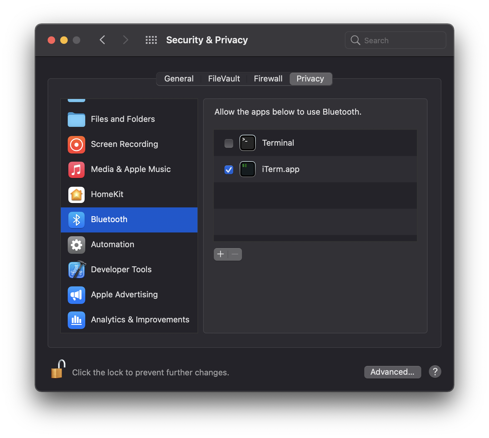
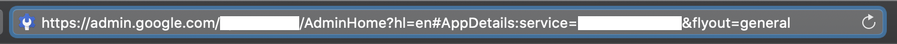
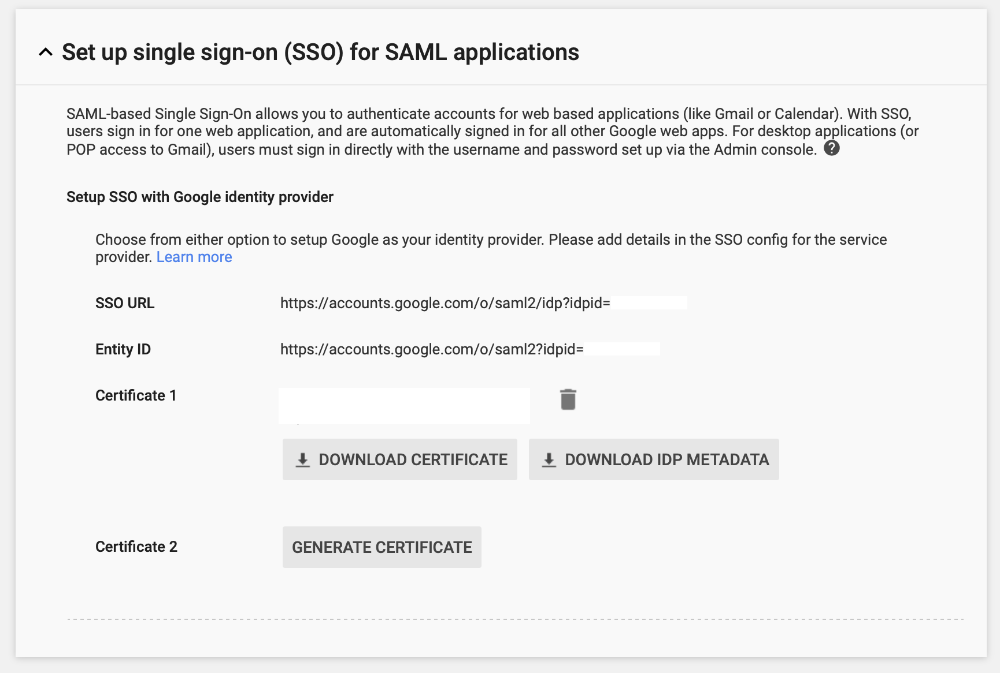
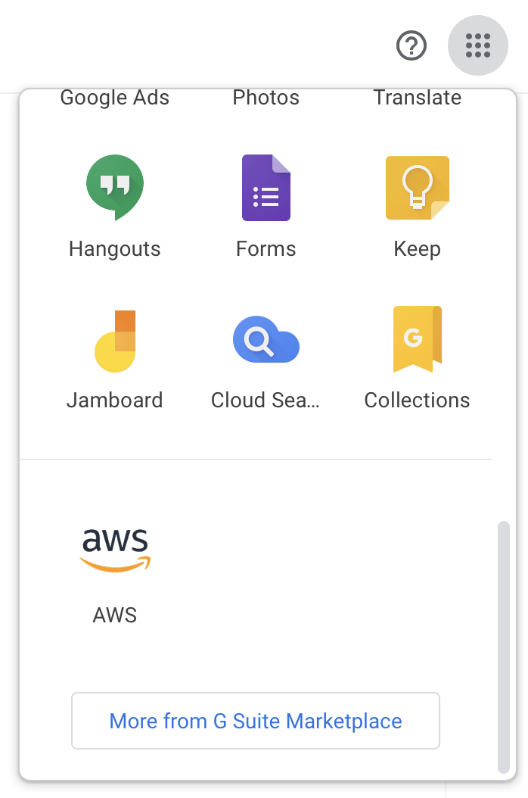

<p align="center">
    
  <p align="center">AWS STS credentials via Google Workspace</p>
</p>

`gsts` (short for `Google STS`) is a fork of [aws-google-auth](https://github.com/cevoaustralia/aws-google-auth) based on [puppeteer](https://pptr.dev) instead of scraping which aims to obtain and store AWS STS credentials to interact with Amazon services by authenticating against a pre-configured Google Workspace SAML instance.

This allows you to configure AWS to rely on Google Workspace as your identity provider, moving the responsibility away from Amazon into Google to validate your login credentials. This is a widly popular solution when looking to offer Single-Sign On capabilities inside organizations.

The problem is that this flow is tailored for the web which makes command-line usage a lot more difficult. This utility is helper around that.

#### Features:

* First-time only headful design for interactively entering your Google Workspace credentials.
* Full support for all 2FA methods as provided by Google, including [security keys](#security-keys--webauthn--u2f).
* Persistent headless re-authentication system.
* Supports custom session durations (from 15min to 12h).
* Compatible with Amazon ECR.
* Daemon helper for continously refreshing the STS token (only available on macOS for now).
* Offers a quick action to open the AWS console from the command-line.
* Support for AWS China (`aws-cn`) and AWS GovCloud (US) (`aws-us-gov`) ARNs.

## Installation

### macOS

```shell
brew tap ruimarinho/tap
brew install gsts
```

#### Big Sur Compatibility

Under Big Sur, if you're not using `Terminal.app` to launch `gsts`, you will need to manually grant the Bluetooth permission under Security & Privacy preferences to your terminal app (e.g. `iTerm`), otherwise `puppeteer` is unable to manage a permission request for Chrome / Chromium to use Bluetooth and crashes immediately.



### Other Platforms

Install the package via `npm`:

```sh
npm install --global gsts
```

or via `yarn`:

```
yarn global add gsts
```

The install process will automatically trigger the download of Chromium required by puppeter.

## Usage

There are three key options or variables you need know about (you can read more about how to discover them below):

1. Google's Identity Provider ID, or IDP ID.
1. Google's Service Provider ID, or SP ID.
1. AWS role ARN to authenticate with.

You can then launch `gsts` using command-line options:

```sh
gsts --aws-role-arn arn:aws:iam::123456789:role/foobar --sp-id 12345 --idp-id A12bc34d5 --username foo@bar.com
```

Alternatively, you can use environment variables instead:

```sh
GOOGLE_USERNAME=foo@bar.com GOOGLE_SP_ID=12345 GOOGLE_IDP_ID=A12bc34d5 gsts
```

That's it! The first authentication will be performed directly on a headful browser where all of the authentication challenges generated by Google are natively supported (TOTP, Push, SMS, Security Keys, etc). Subsequent runs use an existing session to obtain fresh STS credentials every time the utility is executed.

To make sure the profile generated by `gsts` - by default, called `sts` - is used on other tools interacting with AWS services via STS tokens (`aws`, `kubectl`, etc.), make sure `AWS_PROFILE=sts` is set as an environment variable. Alternatively, you can force `gsts` to use the _default_ profile name by using `gsts --aws-profile=default`.

### Security Keys / WebAuthn / U2F

The existing Google Sign In page for SAML services (`https://accounts.google.com/ServiceLogin`) appears to running a previous version of the retail Google Sign In page (`https://accounts.google.com/signin/v2/identifier`) which does not offer support for WebAuthn. Consequently, since only U2F is supported, an additional internal extension (also known as a _component extension_) called [CryptoTokenExtension](https://github.com/google/u2f-ref-code/blob/master/u2f-gae-demo/war/js/u2f-api.js) also needs to be loaded (extension id `kmendfapggjehodndflmmgagdbamhnfd`).

Since extensions typically use background pages and puppeteer does not have a way to wait for them, the project authors decided to disable loading all types of extensions (both user-provided and [component extensions](https://github.com/puppeteer/puppeteer/pull/4704)) presumably to increase performance and avoid future confusion. Typically, automation tools would not be to interact with those extensions anyway in a headless way.

Additionally, this extensions uses [chrome.runtime](https://github.com/google/u2f-ref-code/blob/1772b2ff4d6357146e7d3a60d2a33ff29245ecff/u2f-gae-demo/war/js/u2f-api.js#L196) for communication, a common property used by providers to [detect the presence](https://github.com/berstend/puppeteer-extra/blob/master/packages/puppeteer-extra-plugin-stealth/evasions/chrome.runtime/index.js) of an automated browser session using tools like puppeteer.

In conclusion, the only alternative to successfully enable legacy U2F support on puppeteer is to skip this evasion technique and enable component extensions. For the time being and due to the potential increase in detection, U2F support remains behind a feature flag.

### `credential_process`

`gsts` can be invoked as a credential source through [`credential_process`](https://docs.aws.amazon.com/cli/latest/userguide/cli-configure-sourcing-external.html) with the `--json` option.

For example, add this to your `~/.aws/config` file:

```
[profile sts]
credential_process = gsts --aws-role-arn arn:aws:iam::123456789:role/foobar --sp-id 12345 --idp-id A12bc34d5 --json
```

## Amazon ECR

If you'd like to automatically authenticate your Docker installation before pulling private images from Amazon ECR, you can use the fantastic [ECR Docker Credential Helper](https://github.com/awslabs/amazon-ecr-credential-helper) in combination with `gsts`.

1. Install `docker-credential-helper-ecr` (on macOS, you can do it via Homebrew using `brew install docker-credential-helper-ecr`).
2. Create a file named `docker-credential-gsts` which needs to be on your `PATH` environment variable. To keep things organize, let's create it inside `~/.docker/bin/` and add that folder to `PATH`.

    ```sh
    #!/bin/sh
    gsts < /dev/tty > /dev/tty
    exec docker-credential-ecr-login $@
    ```

    Make sure the file is executable with `chmod +x ~/.docker/bin/docker-credential-gsts`.

3. Add the following config to your `~/.docker/config.json` file, provided `gsts` is in your `PATH`:

    ```json
    {
      "credHelpers" : {
        "<ACCOUNT_ID>.dkr.ecr.<ECR_REGION>.amazonaws.com" : "gsts"
      }
    }
    ```

4. Depending on your setup, you may need to specify an additional environment variable `AWS_DEFAULT_REGION` (e.g. `us-east-1`).

The next step a `docker pull` for an image from an ECR registry matching the string above is called, Docker will invisibly call `gsts` and perform authentication on your behalf.

## Daemon

If you are a heavy Amazon AWS user with a constant need of a fresh STS token or if you find the maximum amount of time a session can live by Amazon's own rules too short (12 hours), you can setup a helper to periodically call `gsts` for you.

### macOS

`gsts` comes with a basic LaunchAgent plist generator which it will try to copy to `~/Library/LaunchAgent/io.ruimarinho.gsts.plist` and automatically load.

The `gsts` helper doesn't actually run in background. The OS native scheduler will periodically (every 10min) execute `gsts` for you to make sure a fresh STS token is available whenever you need it.

Simply call `gsts` with the daemon option to install the helper:

```sh
gsts --daemon
```

If `/usr/local/var/log/` is not user-writable, you may create that directory or customize the path for logs using `--daemon-out-log-path` and `--daemon-error-log-path`.

You may safely disable the helper at any time by unloading:

```
launchctl unload ~/Library/LaunchAgents/io.ruimarinho.gsts.plist
```

## Quick Actions

`gsts` offer a quick way to open the Amazon AWS console via the command line:

```sh
gsts console
```

## Reference

```sh
❯ gsts --help

Commands:
  gsts console

Options:
  --help                             Show help                         [boolean]
  --version                          Show version number               [boolean]
  --aws-profile                      AWS profile name for storing credentials
                                                                [default: "sts"]
  --aws-role-arn                     AWS role ARN to authenticate with
  --aws-session-duration             AWS session duration in seconds (defaults
                                     to the value provided by the IDP, if set)
                                                                        [number]
  --aws-shared-credentials-file      AWS shared credentials file
                                 [default: "~/.aws/credentials"]
  --clean                            Start authorization from a clean session
                                     state
  --daemon                           Install daemon service (only on macOS for
                                     now)
  --daemon-out-log-path              Path for storing the output log of the
                                     daemon
                                 [default: "/usr/local/var/log/gsts.stdout.log"]
  --daemon-error-log-path            Path for storing the error log of the
                                     daemon
                                 [default: "/usr/local/var/log/gsts.stderr.log"]
  --enable-experimental-u2f-support  Enable experimental U2F support
  --json                             JSON output (compatible with AWS config
                                     credential_process)
  --force                            Force re-authorization even with valid
                                     session
  --idp-id, --google-idp-id          Google Identity Provider ID (IDP ID)
                                                                      [required]
  --puppeteer-executable-path        Set custom executable path for puppeteer
                                                                 [default: null]
  --sp-id, --google-sp-id            Google Service Provider ID (SP ID)
                                                                      [required]
  --username, --google-username      Google username to auto pre-fill during
                                     login
  -v, --verbose                      Log verbose output                  [count]
```

For compatibility reasons, most environment variables supported [aws-google-auth](https://github.com/cevoaustralia/aws-google-auth) are also supported by `gsts`:

| Description | Command-Line Option | Env Variable | Required |
|-------------|---------------------|--------------|----------|
| Google IDP ID | `--idp-id` | `$GOOGLE_IDP_ID` | Yes |
| Google SP ID | `--sp-id` | `$GOOGLE_SP_ID` | Yes |
| Google Username | `--username` | `$GOOGLE_USERNAME` | No |
| AWS Shared Credentials File | `--aws-shared-credentials-file` | `$AWS_SHARED_CREDENTIALS_FILE` | No (_default: ~/.aws/credentials_) |
| AWS Profile | `--aws-profile` | `$AWS_PROFILE` | No (_default: default_)

## Discovery of IDP and SP IDs

If you're the admin of Google Workspace, after configuring the SAML application for AWS you can extract the SP ID by looking at the `service` parameter of the SAML AWS application page.



The IDP ID can be found under _Security > Set up single sign-on (SSO) for SAML applications_ as the parameter `idpid`.



In case you are using a pre-configured AWS SAML application as traditionally available under the dotted menu on any Google app (Gmail, Calendar and so on) you can instead right-click the AWS icon and copy the link:



The copied URL will be in the format of `https://accounts.google.com/o/saml2/initsso?idpid=<IDP_ID>&spid=<SP_ID>&forceauthn=false`.

## Troubleshooting

**I keep getting asked to re-login using the headful instance even after being succesfully logging in.**

Sometimes puppeteer can get confused with the session state Chromium's data directory. If you can't get out of this loop, you should try starting from a clean session directory instead using `gsts --clean`.

**gsts conflicts with an alias from oh-my-zsh's git plugin**

[ohmyzsh's git plugin](https://github.com/ohmyzsh/ohmyzsh/tree/master/plugins/git) includes an alias named `gsts` as a shorthand for `git stash show --text`. You can either disable the `git` plugin entirely or, alternatively, add `unalias gsts` at the end of your dotfiles if you don't use this git command often.

**"Error when retrieving credentials from custom-process: Error: Failed to launch the browser process!" when using the aws-cli with credential_process**

Although seamingly unrelated to `gsts`, try unsetting `LD_LIBRARY_PATH` before calling it, like so:

```bash
credential_process = bash -c "unset LD_LIBRARY_PATH; gsts --aws-role-arn arn:aws:iam::123456789:role/foobar --sp-id 12345 --idp-id A12bc34d5 --username foo@bar.com --json"
```

**Error: Browser is not downloaded. Run "npm install" or "yarn install"**

Some users have [reported](https://github.com/ruimarinho/gsts/issues/20) issue getting puppeteer up and running when install gsts globally with a message that the browser cannot be downloaded.

If you encounter this error, please run the following commands as a workaround:

```shell
cd /usr/local/lib/node_modules/gsts/node_modules/puppeteer
node install.js
```

## License

MIT
